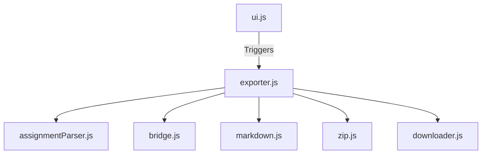

# Assignment Export Feature

## Motivation
Students often want to save their assignment problem statements, MCQs, and their written code for offline review, interview preparation, or archiving. Manually copy-pasting code and problem statements from multiple pages is tedious.

## User Workflow
1. A student navigates to any coding or MCQ assignment page on the Scaler platform.
2. They click the "Export" button injected into the header next to the problem title.
3. They select either:
   - **Export This Problem**: Instantly downloads the active problem as a Markdown file.
   - **Export All (ZIP)**: Triggers a background process that silently iterates through all problems in the assignment sidebar, zipping them into a single archive before prompting a download.

## UI Overview
- The UI consists of a non-intrusive, styled "Export" button with a dropdown (`ui.js`).
- The button provides visual feedback during long-running bulk exports (e.g., displaying "Exporting 3/10..." and disabling interactions).
- Upon completion, the button transitions to a green "✓ Downloaded" state for 1.5 seconds.
- The UI handles focus rings for keyboard accessibility and closes automatically upon clicking outside.

## Architecture Overview
The feature is heavily decoupled, using a strict one-way data flow orchestrator pipeline.



## Component Responsibilities
- `content/utils/assignmentParser.js`: Generic DOM scraper for Scaler assignments. Reused by `leetcodeLink.js`.
- `content/features/assignmentExport/assignmentExport.js`: Entry point. Polls the DOM and checks extension settings.
- `content/features/assignmentExport/ui.js`: Injects the Export button and handles UI state.
- `content/features/assignmentExport/exporter.js`: The orchestrator. Fetches URLs, manages hidden iframes, and pipes data through the layers.
- `content/features/assignmentExport/bridge.js`: Injects `pageBridge.js` and listens for custom events.
- `content/features/assignmentExport/pageBridge.js`: Executes in the page context to access `window.monaco`.
- `content/features/assignmentExport/markdown.js`: Serializes structured text into formatted Markdown.
- `content/features/assignmentExport/zip.js`: A thin wrapper around JSZip for Blob generation.
- `content/features/assignmentExport/downloader.js`: Handles Blob URL generation and `<a download>` triggering.

## Export Pipeline
1. **User clicks Export**: `ui.js` triggers `exporter.js` and locks the UI.
2. **Parser**: `assignmentParser.js` extracts Title, Session, Question Type, Statement, and MCQ options.
3. **Bridge**: `bridge.js` extracts the user's code from the Monaco editor.
4. **Markdown**: `markdown.js` formats the parsed strings into a `.md` string, complete with a metadata header.
5. **ZIP (Bulk only)**: `zip.js` stores the `.md` string in a structured JSZip archive.
6. **Download**: `downloader.js` converts the string/archive to a Blob and downloads it.

## Parser Design
`assignmentParser.js` is designed to be fully generic. Every function accepts an optional `doc = document` parameter. This allows the parser to scrape data from both the active user-facing DOM and from isolated `iframe.contentDocument` contexts during bulk exports, maximizing code reuse.

## Bridge Communication
Chrome Extensions run content scripts in an "Isolated World". They can see the page's DOM, but cannot see the page's JavaScript variables (like `window.monaco`). 
`pageBridge.js` is injected directly into the DOM (`<script>`) so it runs in the "Main World". It reads `window.monaco` and uses `window.dispatchEvent(new CustomEvent(...))` to send the code back to the isolated `bridge.js`.

## Hidden Iframe Approach
To perform a "Bulk Export" of an entire assignment without redirecting the user, `exporter.js` creates an invisible `<iframe>`. 
- **Why?** Scaler is a Single Page Application (SPA). The backend API is heavily authenticated and complex to reverse-engineer. Loading the page in an iframe allows us to reuse the existing React SPA logic and our existing DOM parsers.
- **Trade-offs:** It is slightly slower (sequential page loads) and requires robust timeout handling in case the React SPA hangs.
- **Alternatives considered:** Fetching raw HTML (failed because code is rendered via JS), or reverse-engineering the GraphQL/REST API (brittle to upstream changes).

## Markdown Format
Formatted with GitHub-flavored markdown.
- Starts with an H1 problem title.
- Followed by a metadata block (Session, Question Number, Question Type, Date).
- Code is fenced in ` ` ` ` blocks. 
- MCQs use checkbox syntax (`- [ ] **A)** Option`). Code fences are omitted if the question is an MCQ.

## ZIP Structure
Bulk exports group all files inside a top-level directory named after the Session Title. Filenames are padded for proper OS sorting.
```text
Concurrency 4 - Locks and Thread-Safe Programming/
    01 - Synchronization using Semaphores - 1.md
    02 - Synchronization using Semaphores - 2.md
```

## Error Handling
- **Concurrency Locks**: `isExporting` flag prevents users from triggering parallel bulk exports.
- **Iframe Sandboxing**: Every iframe iteration is wrapped in a `Promise.race` timeout (10s) and a `try/catch`. If an iframe crashes due to CORS redirects or SPA failures, it is cleanly caught and the exporter proceeds to the next problem.
- **Memory Leaks**: The bulk export is wrapped in a strict `try...finally` block that guarantees the invisible iframe is purged from the DOM even if a fatal exception occurs.

## Testing Strategy
- **Unit Tests**: Pure functions like `markdown.js` are tested via Node's native test runner (`node:test`).
- **Parser Tests**: `assignmentParser.js` logic is validated by feeding mocked HTML strings into `JSDOM` environments.
- **Testing Constraints**: Browser-dependent DOM manipulation inside `exporter.js` and `ui.js` is validated via manual QA.

## Known Limitations
- If Scaler changes their DOM class names, `assignmentParser.js` may need updates.
- If the user's internet drops while exporting, the iframe will time out after 10 seconds per problem and export empty files.

## Future Improvements
- Add a visual progress bar instead of updating the button text.
- Add support for exporting hints or solution approaches.
- Support parallel scraping (e.g. 2-3 iframes at once) for large assignments.
